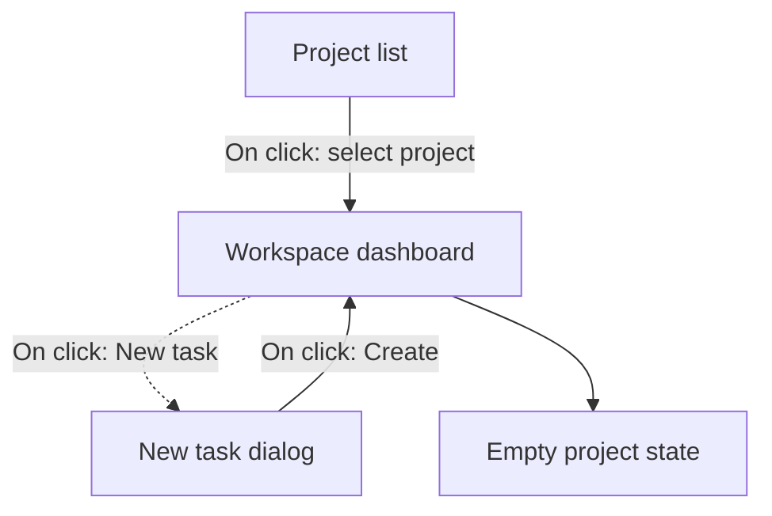

<!--
EXAMPLE OUTPUT for the lore:figma-to-doc skill.
Shown for an English-language project documenting a generic project-management
product. Your real output follows the project's documentation language (§7) and
its own template. Image paths use /img/ (physical files live in static/img/).
-->

# Project Workspace Overview

## Introduction & Purpose

The **Project Workspace** is the landing surface a member sees after selecting a project. It exists to give the team a single place to see status, recent activity, and the actions available for their role.

**Business goal:** reduce time-to-first-action for new members and cut support questions about "where do I find X" by surfacing the most common tasks on one screen.

## Scope

This document covers the Workspace **dashboard** only: its layout, the per-role action set, and the empty state. It does **not** cover task editing, billing, or notification settings (each documented separately). The Workspace is shipping in **Phase 1**; the analytics panel shown greyed-out in the design is Phase 2 and is out of scope here.

## Audiences & Roles

| Role | Access |
|------|--------|
| Owner | Full access; can archive the project and manage members. |
| Editor | Can create and edit tasks; cannot archive or manage members. |
| Viewer | Read-only; sees the dashboard but no create/edit actions. |

## Key Performance Indicators (KPIs)

- Time-to-first-action for a newly added member (target: under 30 seconds).
- Share of sessions that use a dashboard quick action (target: ≥ 60%).

## Terms & Definitions

- **Quick action** — a one-click shortcut in the dashboard header (e.g. "New task").
- **Activity feed** — the reverse-chronological list of recent changes in the project.

# Business Rules

- The **New task** quick action is visible only to Owner and Editor roles; Viewers do not see it (annotation: *"Hide create actions for read-only members"*).
- The activity feed shows at most the **20** most recent events; older events are reachable from the full History page.
- An archived project renders the dashboard in read-only mode for **all** roles, including the Owner, until it is restored.

# Scenarios

The prototype wiring in the design defines two flows from the dashboard. This chart
maps them (solid = navigation, dashed = dialog/overlay):

## Scenario: Open a project and take the first action

**Purpose:** a member opens a project and creates their first task from the dashboard.

**Roles Involved:** Owner, Editor.

**Preconditions:** the member is signed in and belongs to at least one project.

**Main Flow:**

1. The member selects a project from the project list.

   

2. The system shows the dashboard with the header quick actions and the activity feed.
3. The member clicks **New task**.

   

4. The system opens the New task dialog with the title field focused.
5. The member enters a title and clicks **Create**.
6. The system creates the task, closes the dialog, and prepends a "Task created" entry to the activity feed.

**Postconditions:** the new task exists in the project and appears at the top of the activity feed.

## Scenario: Empty project (no tasks yet)

**Purpose:** document what a brand-new project shows before any task exists.

**Roles Involved:** Owner, Editor, Viewer.

**Preconditions:** the project has zero tasks.

**Main Flow:**

1. The member opens a project that has no tasks.

   

2. The system shows an empty state: the message "No tasks yet" and, for Owner/Editor, a **Create your first task** button. Viewers see the message without the button.

**Postconditions:** none (no state change). The empty state persists until the first task is created.

# Dependencies & Prerequisites

- Relies on the **Membership** service for the current member's role (drives which quick actions render).
- The activity feed depends on the **Events** API; if it is unavailable the feed shows a non-blocking "Activity is temporarily unavailable" notice while the rest of the dashboard renders.

# Roadmap

- **Phase 2:** the analytics panel (shown disabled in the design) adds per-project throughput charts.

# Appendix & Resources

- Figma: *Project Workspace v3* — pages **Dashboard**, **Empty States** (page **[ignore] Exploration** was skipped).

<!--
The Final Report (CLAUDE.md §8) is delivered IN CHAT at task completion — it is a
process deliverable for the user and is NEVER written into the documentation file.
It names the skill, subagents, and internal paths, none of which may appear in
reader-facing docs (Rule 5). It is intentionally omitted from this example file.
-->

