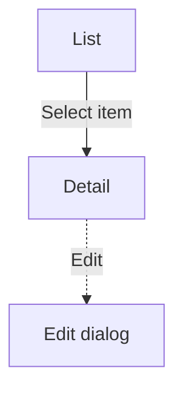

<!-- ============================================================================
Product Document Template — the canonical structure for ONE documented section
(a feature/module). This file is the Single Place of Truth for document
structure (Rule 4): skills and the validator reference "the template" rather
than restating its sections.

HOW TO USE
- Fill top to bottom. Replace the italic guidance under each heading with real
  content — never ship the guidance text.
- Sections tagged {Optional — delete if not applicable} must be REMOVED when
  they don't apply. A heading with nothing under it is worse than no heading;
  empty KPI/Roadmap/Terms sections are the #1 reason these docs rot.
- ⛔ MDX: never let a `{...}` reach a file under docs/ — Docusaurus evaluates
  it as JavaScript and the build fails. That includes the `{Optional — …}`
  markers below: delete the marker (and the section, if unused) before saving.
- Split rule: when a section would exceed the §2 threshold (more than 6
  scenarios OR more than 3000 words), keep this structure but distribute it
  across an overview `index.md` + sibling sub-pages. See `.claude/CLAUDE.md` §2.
- This body is separate from the YAML frontmatter every document needs
  (sidebar_position, title, description, tags — see `.claude/CLAUDE.md` §6).
============================================================================ -->

<!-- Document Info — a small trust block so a reader knows at a glance whether
the doc is current, who owns it, and when it was last checked against reality.
Keep it here in the body (NOT in frontmatter — the hooks validate only the 4
YAML keys). Fill every row; use "—" when genuinely unknown. -->

| Field | Value |
|-------|-------|
| **Status** | Draft / Current / Needs review |
| **Owner** | The team or role that keeps this accurate |
| **Last verified** | YYYY-MM-DD — against which source (design vX / live site / epic) |

# Summary & Introduction

## Title

The name of the module or business feature being documented.

## Introduction & Purpose

A short description of this feature: why it exists and what need it addresses.

**Business goal:** the value this feature delivers to the business (revenue, acquisition, better UX, reduced support load, …). State the goal even when it is not yet measurable — a qualitative goal is far better than an empty section.

## Scope

What this part of the product does — and its boundaries. If the module is built in phases, state the current phase.

**Out of scope:** what a reader might expect to find here but that is deliberately NOT covered — because it is documented elsewhere or not yet built. Naming the boundary prevents wrong assumptions.

## Audiences & Roles

The roles that interact with this feature and each one's access level. If behavior is identical for all roles, say so in plain language (e.g. "All users see the same behavior").

<!-- {Optional — delete this comment and the table if roles share the same
permissions} A permissions matrix makes role differences scannable:

| Capability | Owner | Editor | Viewer |
|------------|:-----:|:------:|:------:|
| View       |  ✓    |  ✓     |  ✓     |
| Create     |  ✓    |  ✓     |  —     |
-->

## Success signals (KPIs) {Optional — delete if none defined}

The indicators that show this feature is working: active users, conversion, time-on-task, retention, support-ticket reduction, … Qualitative signals count.

## Terms & Definitions {Optional — delete if none needed}

Domain-specific terms or abbreviations used in this document.

# Business Rules

The rules, constraints, and key business logic for this feature. Give each rule a **stable ID** (`BR-1`, `BR-2`, …) so scenarios and reviews can point to it. Write each rule so it is **specific and checkable** — a condition the system or an actor can detect — not vague.

- **BR-1** — Validation: a required field must be filled before the form submits.
- **BR-2** — Limit: an input must not exceed {a defined maximum}.
- **BR-3** — Access: an action is available only to users on a paid plan.

# Scenarios

## List of Scenarios

Name each scenario that maps to a flow (e.g. "Create an item", "Edit profile").

<!-- {Optional — delete this comment and the diagram if the feature is a single
screen with no navigation} A flow diagram gives a bird's-eye map of the screens
and the paths between them. Solid = navigating to a new screen; dashed = a
dialog/overlay. (Requires Mermaid — enabled in Lore's Docusaurus config.)

-->

## Details for Each Scenario

Repeat the block below once per scenario.

**Purpose** — what the user does in this scenario, and why.

**Roles Involved** — which roles take part.

**Preconditions** — what must be true first (signed in, on a paid plan, …). List only what is worth telling the reader.

**Main Flow** — the nothing-goes-wrong path, step by step, each step paired with the system's reaction. Place the illustrating screenshot inline at the exact step it depicts (see `.claude/CLAUDE.md` §4).

1. The user does X. → The system responds with Y.
2. …

**Extensions — Alternative & Exception Flows** — where errors, validation failures, empty states, and edge cases live. In a real feature this is usually the largest part of the scenario. Anchor each branch to the Main Flow step it departs from, using step-letter numbering: `3a` is a condition at step 3; `3a1`, `3a2` are its handling steps. Write each condition as something detectable.

- **3a.** {condition — e.g. "the title field is empty"}:
  - **3a1.** The system shows "{exact message}" and keeps focus on the field.
- **4a.** {condition — e.g. "the upload exceeds BR-2's limit"}:
  - **4a1.** The system blocks the upload and shows "{exact message}".

Mandatory detail (per §4): all user options, all form fields (required vs optional), all validation rules, all system messages with their exact wording, and edge cases (empty, maximum, error).

**Postconditions** — what is true after the scenario completes.

# Open Questions {Optional — delete when nothing is open}

Unresolved questions and `[CLARIFICATION NEEDED: …]` items, each dated, with an owner where known. Removing this section (rather than leaving it empty) is the signal that the doc is settled.

- YYYY-MM-DD — {question} — waiting on {who}.

# Dependencies & Prerequisites {Optional — delete if none}

Other parts of the product or external modules this feature relies on (a specific API, a payment integration that must be enabled first, …).

# Roadmap {Optional — delete if none}

Planned later phases or capabilities, at a high level.

# Changelog

A running record of substantive changes to this document, so a reader can see when and why it last changed. Newest first.

| Date | Change | Source |
|------|--------|--------|
| YYYY-MM-DD | Initial version | design vX / epic / live site |

# Appendix & Resources {Optional — delete if none}

Links to related materials (UI mockups, user stories, technical/architecture docs). Attach related spreadsheets or PDFs here.
