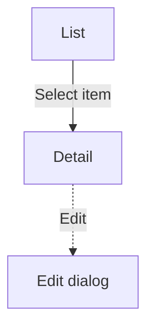

<!-- ============================================================================
Product Document Template — the canonical structure for ONE documented section
(a feature/module). This file is the Single Place of Truth for document
structure (Rule 4): skills and the validator reference "the template" rather
than restating its sections.

HOW TO USE
- Fill top to bottom. Replace the italic guidance under each heading with real
  content — never ship the guidance text.
- Write ONLY what the source (design / brief / live site) actually supports.
  If a fact is not in the source, do not invent it: leave the slot out, or mark
  it `[CLARIFICATION NEEDED: what is missing]`. Accuracy beats completeness —
  a short, true doc beats a long, half-guessed one.
- Optional sections are marked `_(Optional — delete this heading if …)_`. When
  they don't apply, DELETE the heading and its marker. An empty heading is worse
  than no heading: it produces a dead table-of-contents entry and signals rot.
  Empty KPI/Roadmap/Terms sections are the #1 reason these docs decay.
- ⛔ HEADINGS: the page title comes from the YAML frontmatter `title` (see
  `.claude/CLAUDE.md` §6) — Docusaurus renders it as the page's single H1. Do
  NOT add a `#` (H1) heading in the body. Top-level sections are `##` (H2),
  sub-parts are `###` (H3). Don't skip levels (no H2 → H4). The on-page table of
  contents shows only H2/H3, so keep structural sections at those levels.
- ⛔ MDX: never let a bare `{...}` reach a file under docs/ — Docusaurus
  evaluates it as JavaScript and the build fails. This template uses square
  brackets `[like this]` for fill-in slots for that reason. The `_(Optional …)_`
  markers and these HTML comments must also be removed before saving.
- Split rule: when a section would exceed the §2 threshold (more than 6
  scenarios OR more than 3000 words), keep this structure but distribute it
  across an overview `index.md` + sibling sub-pages. See `.claude/CLAUDE.md` §2.
- This body is separate from the YAML frontmatter every document needs
  (sidebar_position, title, description, tags — see `.claude/CLAUDE.md` §6).
============================================================================ -->

<!-- Document Info — a small trust block so a reader knows at a glance whether
the doc is current, who owns it, and when it was last checked against reality.
Keep it here in the body (NOT in frontmatter — the hooks validate only the 4
YAML keys). Fill every row; use "—" when genuinely unknown. "Last verified" is
the date someone last checked this doc AGAINST ITS SOURCE, not the last edit. -->

|  |  |
|--|--|
| **Status** | Draft / Current / Needs review |
| **Owner** | The team or person accountable for keeping this accurate |
| **Last verified** | YYYY-MM-DD — against which source (design vX / live site / epic) |

## Introduction & Purpose

Lead with the problem: what need or friction does this feature address, and for whom? Then state what the feature is, in a sentence or two. A concrete "before this existed, a user had to …" framing beats an abstract description.

**Business goal:** the value this feature delivers to the business (revenue, acquisition, better UX, reduced support load, …). State the goal even when it is not yet measurable — a qualitative goal is far better than an empty section.

## Scope

What this part of the product does — and its boundaries. If the module is built in phases, state the current phase.

**Out of scope (non-goals):** what a reader might expect to find here but that is deliberately NOT covered — because it is documented elsewhere, or intentionally excluded. Naming the boundary prevents wrong assumptions and scope creep.

## Audiences & Roles

The roles that interact with this feature and each one's access level. If behavior is identical for all roles, say so in plain language (e.g. "All users see the same behavior").

<!-- {Optional — delete this comment and the table if roles share the same
permissions} A permissions matrix makes role differences scannable:

| Capability | Owner | Editor | Viewer |
|------------|:-----:|:------:|:------:|
| View       |  ✓    |  ✓     |  ✓     |
| Create     |  ✓    |  ✓     |  —     |
-->

## Success signals (KPIs)

_(Optional — delete this heading if no signals are defined.)_

The indicators that show this feature is working: active users, conversion, time-on-task, retention, support-ticket reduction, … Qualitative signals count.

## Terms & Definitions

_(Optional — delete this heading if no domain terms need defining.)_

Domain-specific terms or abbreviations used in this document.

## Business Rules

The rules, constraints, and key business logic for this feature. Give each rule a **stable ID** (`BR-1`, `BR-2`, …) so scenarios and reviews can point to it. Write each rule to be **declarative and checkable** — state the condition or constraint (what must, must not, or may be true), not the workflow steps that enforce it. Keep each rule atomic: one idea per entry.

- **BR-1** — Validation: a required field must be filled before the form submits.
- **BR-2** — Limit: an input must not exceed [a defined maximum].
- **BR-3** — Access: an action is available only to users on a paid plan.

## Scenarios

Name each scenario that maps to a flow (e.g. "Create an item", "Edit profile"). This list is the fastest summary of what the feature does — keep the names short and goal-oriented. **Number the scenarios in order** so they can be referenced unambiguously (from a review, from the Mobile & Tablet View section, or in conversation).

<!-- {Optional — delete this comment and the diagram if the feature is a single
screen with no navigation} A flow diagram gives a bird's-eye map of the screens
and the paths between them. Solid = navigating to a new screen; dashed = a
dialog/overlay. (Requires Mermaid — enabled in Lore's Docusaurus config.)

-->

Then document each scenario with its own `###` sub-heading, repeating the block below. Number each sub-heading in order and name it after the scenario's goal — the format is `### Scenario N: [goal phrase]` (e.g. `### Scenario 1: Create an item`). Translate the word "Scenario" and use the numerals of the document's language.

### Scenario 1: [goal phrase]

**Purpose** — what the user does in this scenario, and why.

**Roles Involved** — which roles take part.

**Preconditions** — what the system can guarantee is already true before this scenario starts (signed in, on a paid plan, …). Only conditions that are genuinely guaranteed belong here; "usually true" context goes in Purpose, not here.

**Main Flow** — the nothing-goes-wrong path, step by step, each step paired with the system's reaction. Keep steps at the behavior level — omit incidental UI detail that doesn't matter to the rule being shown. Place the illustrating screenshot inline at the exact step it depicts (see `.claude/CLAUDE.md` §4).

1. The user does X. → The system responds with Y.
2. …

**Extensions — Alternative & Exception Flows** — where errors, validation failures, empty states, and edge cases live. In a real feature this is usually the largest part of the scenario. Anchor each branch to the Main Flow step it departs from, using step-letter numbering: `3a` is a condition at step 3; `3a1`, `3a2` are its handling steps. Write each condition as something detectable.

- **3a.** [condition — e.g. "the title field is empty"]:
  - **3a1.** The system shows "[exact message]" and keeps focus on the field.
- **4a.** [condition — e.g. "the upload exceeds BR-2's limit"]:
  - **4a1.** The system blocks the upload and shows "[exact message]".

**Edge-case coverage taxonomy** — before closing a scenario, walk its Extensions against these categories, roughly ordered by production-defect frequency. A category the source addresses becomes an Extension; a category that applies but the source is silent on becomes a clarification question or a `[CLARIFICATION NEEDED: …]` marker — never an invented branch; a category that does not apply is skipped.

- **Empty / null** — no data yet, zero results, blank or missing values.
- **Boundaries** — min/max limits and off-by-one; defects cluster exactly at the limit.
- **Errors** — network or server failure, timeout, expired session or link.
- **Concurrency** — double-submit, two actors changing the same thing at once.
- **State transitions** — back button mid-flow, re-entry, jumps into an invalid state.
- **Permissions** — a role without access, or access revoked mid-session.
- **Invalid input** — wrong type or format, special characters, malformed files.
- **Internationalization** — long translations, RTL, date/number formats _(only when the product is multi-lingual)_.
- **Bulk operations** — many-at-once actions, very large selections _(only for data-heavy features)_.

Mandatory detail (per §4): all user options, all form fields (required vs optional), all validation rules, all system messages with their exact wording, and edge cases per the coverage taxonomy above.

**Postconditions** — what is true after the scenario completes.

## Mobile & Tablet View

_(Optional — delete this heading if the product has no distinct mobile/tablet design, or the responsive view was not documented.)_

Document **only what differs** from the desktop view — never re-tell a flow already covered above. Cover the layout changes (single-column stacking, elements hidden/moved/collapsed), the navigation pattern (e.g. a hamburger menu replacing a top bar), and any behavior that genuinely changes on a smaller screen (reference the affected scenario by its number, e.g. "In Scenario 2, …"). If a viewport behaves identically to desktop apart from reflow, say so in one line rather than restating steps.

Embed mobile screenshots with a raw HTML tag — ``, never markdown `` syntax — images under that `mobile/` path are automatically shown at half width on desktop and full width on small screens, and only the raw tag keeps the `/mobile/` path intact in the built site (see `.claude/CLAUDE.md` §6). Tablet screenshots go under `/img/{section}/tablet/…` (markdown syntax is fine there) and display full width.

## Open Questions

_(Optional — delete this heading when nothing is open. Removing it, rather than leaving it empty, is the signal that the doc is settled.)_

Unresolved questions and `[CLARIFICATION NEEDED: …]` items, each dated, with an owner where known.

- YYYY-MM-DD — [question] — waiting on [who].

## Dependencies & Prerequisites

_(Optional — delete this heading if none.)_

Other parts of the product or external modules this feature relies on (a specific API, a payment integration that must be enabled first, …).

## Roadmap

_(Optional — delete this heading if none.)_

Planned later phases or capabilities, at a high level.

## Changelog

A curated record of substantive changes to this document — the notable differences a reader would care about, not every commit. Newest first.

| Date | Change | Source |
|------|--------|--------|
| YYYY-MM-DD | Initial version | design vX / epic / live site |

## Appendix & Resources

_(Optional — delete this heading if none.)_

Links to related materials (UI mockups, user stories, technical/architecture docs). Attach related spreadsheets or PDFs here.
